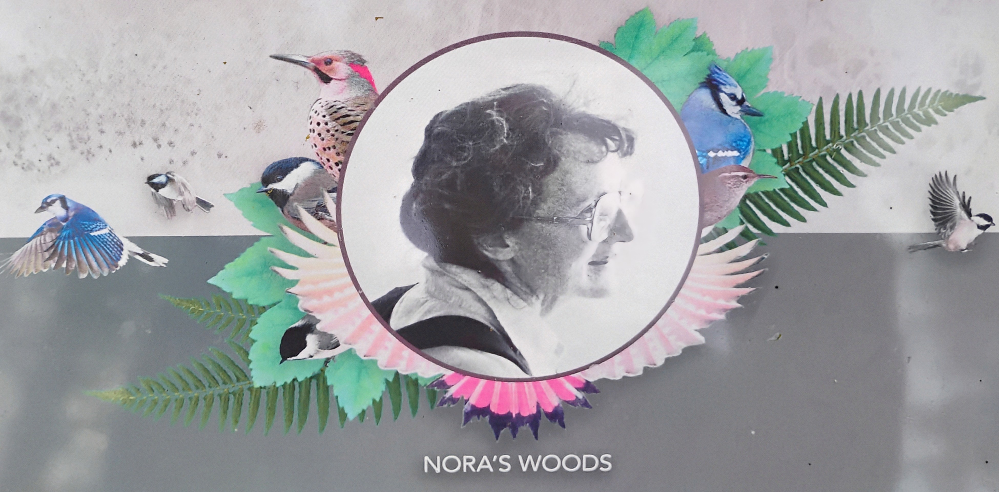

In 1987 Madrona resident, Nora Wood, concerned about the steady loss of green space
in the neighborhood, purchased the park land.
Thick blackberry shrubs, English ivy, and other invasive plants blanketed tons
of trash deposited over many decades. But the lot also had big leaf maples, sword
fern and Oregon grape, and remnants of an apparent apple orchard.

Despite pressure to develop the property, the Wood family
held firm in their desire to preserve green space.
Nora didn't live to see her hopes for the property materialize.
But in 1995 the family turned the property over to The Trust for Public Lands.
The Trust took on the project as an experiment in preserving smaller green spaces
in urban neighborhoods. The Trust provided the initial leadership and drew the
neighborhood into the years-long process that created Nora's Woods.

Hard work and the generosity of many members of the community, steadily transformed
the property. Some neighbors cleared blackberries, one donated money to hire a
landscape architect, others obtained permits and grants frm the city, and some
created art. Look for the Coho salmon, "Homecoming," sculpture commemorating the
abundant salmon runs that long ago inhabited local streams flowing into Lake
Washington. Also look for the bronze leaves embedded in the steps at the northwest
corner entrance.

Today, neighborhood volunteers, in cooperation with the Department of Parks and
Recreation, provide ongoing care of the park.

Enjoy this peaceful place -- a sanctuary of tall trees, native plants, and local
art.

Special thanks to:

- Madrona Community Council
- Seattle Department of Neighborhoods
- Seattle Department of Parks and Recreation
- Trust for Public Land

